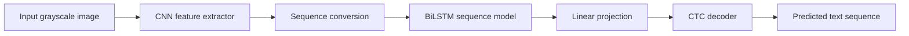

# Distorted Visual Sequence Pattern Recognition using Deep Learning

This project solves a distorted grayscale OCR task: given an image containing a noisy, warped, or partially occluded alphanumeric sequence, predict the ordered text sequence.

The implemented solution uses a CRNN pipeline:



## Project Overview

The dataset contains grayscale sequence images affected by visual distortions such as background noise, overlapping characters, blur, artifacts, shape deformation, occlusion, random patches, irregular spacing, and alignment issues.

The final notebook documents the complete workflow:

1. Problem understanding
2. Dataset exploration
3. Label cleaning
4. Vocabulary construction
5. Preprocessing
6. CRNN model design
7. CTC training
8. Validation and CER analysis
9. Error analysis
10. Test prediction and CSV generation

No extra experiments or unsupported metrics are claimed. Results are reported only from the saved notebook outputs.

## Dataset

The project artifacts show:

| Split | Count | Notes |
| --- | ---: | --- |
| Training images | 20,000 | Grayscale distorted OCR images |
| Raw label rows | 20,000 | From `data/train-labels.csv` |
| Cleaned label rows | 19,998 | Two corrupted/non-standard labels removed |
| Test images | 5,000 | Used for final submission |

The inspected images have shape `100 x 200` pixels. Cleaned labels are six-character uppercase/digit sequences.

## Model Architecture

The model is a Convolutional Recurrent Neural Network:

- CNN feature extractor learns local visual patterns from distorted characters.
- Feature height is collapsed to convert the image into a horizontal sequence.
- A 2-layer bidirectional LSTM models sequence context.
- A linear classifier predicts character classes plus the CTC blank token.
- Greedy CTC decoding removes blanks and repeated consecutive classes.

CRNN is appropriate for this task because character boundaries are unknown and often unreliable due to overlap, occlusion, blur, and irregular spacing.

## Results

Validation results reported in the notebook:

| Metric | Value |
| --- | ---: |
| Train exact-sequence accuracy | 96.64% |
| Validation exact-sequence accuracy | 95.95% |
| Character-level accuracy | 98.83% |
| Character Error Rate | 0.0069 |

The validation split produced 81 exact-sequence mistakes. Error analysis shows common issues such as deletions, insertions, and substitutions between visually similar characters.

## Repository Structure

```text
.
├── data/
│   ├── train-labels.csv
│   ├── train_images/
│   └── test_images/
├── models/
│   ├── crnn_epoch20.pth
│   └── best_crnn_ctc.pt
├── notebooks/
│   └── final_solution.ipynb
├── reports/
│   └── figures/
├── submissions/
│   └── submission_PallaviKumari_24119037.csv
├── archive/
│   ├── notebooks/
│   └── duplicates/
├── requirements.txt
└── README.md
```

Local virtual environments are stored under `.local_envs/` and ignored by Git.

## Setup

Create and activate a Python environment, then install dependencies:

```bash
pip install -r requirements.txt
```

The notebook can run in Google Colab or locally. It looks for data in these locations:

- `cig_ps/cig_ps/`
- `../data/`
- `data/`

When running from `notebooks/final_solution.ipynb`, the existing local dataset is found at `../data`.

## Training

Open `notebooks/final_solution.ipynb` and run the notebook top to bottom. Training uses:

- AdamW optimizer
- learning rate `3e-4`
- weight decay `1e-4`
- CTC loss
- 20 epochs
- gradient clipping with max norm `5.0`

The final model weights are saved as `models/crnn_epoch20.pth` when running from the organized repository structure.

## Inference

The inference pipeline:

1. Loads a grayscale test image.
2. Applies the same normalization used in training.
3. Runs the CRNN model.
4. Applies greedy CTC decoding.
5. Writes predictions to the submission CSV.

Final submission file:

```text
submissions/submission_PallaviKumari_24119037.csv
```

Required CSV format:

```text
image,prediction
test-0.png,QVTQ8A
test-1.png,7PSW9D
```

## Limitations

The current solution uses greedy CTC decoding. The notebook's error analysis shows that the remaining failures are often insertion/deletion mistakes or visually similar character confusions. No unsupported claims are made about beam search, transformers, or attention models because those experiments were not performed.

## Future Work

Potential improvements:

- Beam-search CTC decoding
- Stronger distortion-aware augmentation
- Validation-CER-based checkpoint selection
- Focused handling of repeated-character cases
- More detailed confusion analysis on validation errors

